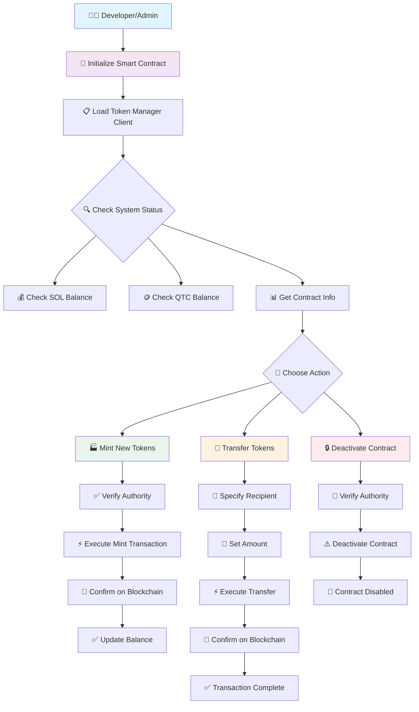
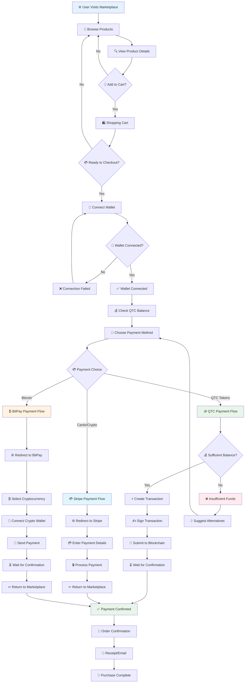
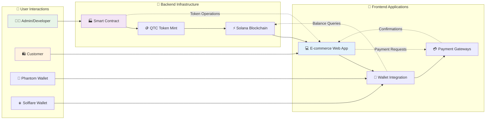
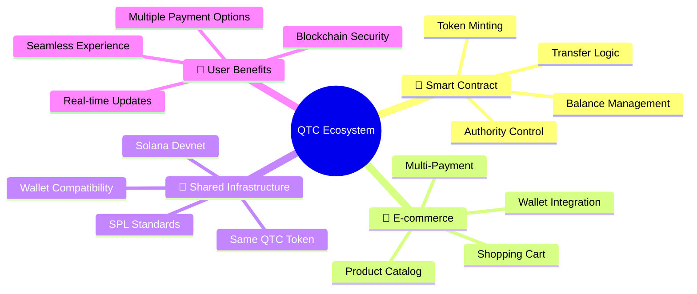

# 🎯 User Flow Diagrams - QTC Blockchain Ecosystem

## 📊 POC 1: Smart Contract User Flow

## 🛒 POC 2: E-commerce Marketplace User Flow

## 🔄 Integrated Ecosystem Flow

## 📋 Detailed User Journey Maps

### 🔧 Smart Contract Admin Journey

| Step | Action | Result | Next |
|------|--------|---------|------|
| 1 | 🚀 Deploy Contract | ✅ Live on Devnet | Initialize |
| 2 | 🔧 Initialize System | ✅ Set Authority | Check Status |
| 3 | 💰 Check Balances | 📊 View SOL/QTC | Choose Action |
| 4 | 🏭 Mint Tokens | ✅ New QTC Created | Update Records |
| 5 | 💸 Transfer Tokens | ✅ Send to Users | Confirm Transfer |
| 6 | 📊 Monitor System | 📈 Track Usage | Ongoing |

### 🛍️ E-commerce Customer Journey

| Step | Action | Experience | Outcome |
|------|--------|------------|---------|
| 1 | 🌐 Visit Site | 📱 Browse Products | Discover Items |
| 2 | 🛒 Add to Cart | 🛍️ Select Items | Build Order |
| 3 | 🔗 Connect Wallet | 👻 Choose Phantom/Solflare | Access Funds |
| 4 | 💰 Check Balance | 📊 View QTC Available | Confirm Affordability |
| 5 | 💳 Choose Payment | 🎯 QTC/Stripe/BitPay | Select Method |
| 6 | ✅ Complete Purchase | 🎉 Order Confirmed | Receive Products |

## 🎯 Key Integration Points

## 🚀 Demo Sequence

### Part 1: Smart Contract Demo (5 minutes)
1. 🔧 Show deployed contract on Solana Explorer
2. 💻 Run JavaScript client demo
3. 🏭 Demonstrate token minting
4. 💸 Show token transfer
5. 📊 Display contract information

### Part 2: E-commerce Demo (10 minutes)
1. 🌐 Navigate to marketplace website
2. 📱 Browse product catalog
3. 🔗 Connect Phantom wallet
4. 🛒 Add items to shopping cart
5. 💰 Show QTC balance check
6. 💳 Demonstrate all three payment methods:
   - QTC token payment (on-chain)
   - Stripe payment (card/crypto)
   - BitPay payment (Bitcoin)
7. ✅ Complete purchase flow

### Part 3: Integration Demo (3 minutes)
1. 🔄 Show same wallet across both systems
2. 📊 Demonstrate balance consistency
3. 🔗 Explain shared token infrastructure
4. 🎯 Highlight ecosystem benefits

---

## 📊 Success Metrics

| Metric | Smart Contract | E-commerce | Combined |
|--------|---------------|------------|----------|
| ⚡ Performance | Gas Efficient | Fast Loading | Scalable |
| 🔒 Security | Authority Controls | Multi-layer Auth | Enterprise Grade |
| 🎯 Usability | Developer Friendly | User Intuitive | Seamless UX |
| 🔗 Integration | Standards Compliant | Multi-gateway | Interoperable |

This ecosystem showcases a **production-ready blockchain commerce solution** with enterprise-grade features and user-friendly interfaces! 🚀